# Схема связи классов Sound Processor

Ниже — схема, где каждый класс/структура описан отдельным блоком, а стрелки показывают, с какими классами он связан и зачем.

## Mermaid class diagram

```mermaid
classDiagram
    class Main {
        <<точка входа программы>>
        +main(int argc, char* argv[])
    }

    class Application {
        <<координатор всего приложения>>
        +configure()
        +start(int argc, char* argv[])
        -print_help() const
        -CmdLineArgs2PipelineConverter converter_
    }

    class ArgsParser {
        <<разбор аргументов командной строки>>
        +parse(int argc, char* argv[])
        +get_input_file()
        +get_output_file()
        +get_filters()
        -in_file_name_
        -out_file_name_
        -filter_descriptors_
    }

    class FilterDescriptor {
        <<описание одного фильтра из CLI>>
        +std::string name
        +std::vector<std::string> params
    }

    class CmdLineArgs2PipelineConverter {
        <<преобразует FilterDescriptor в Pipeline>>
        +add_filter_producer(name, producer)
        +create_pipeline(descriptors)
        -find_producer(name)
        -std::map<std::string, FilterProducer> producers_
    }

    class FilterProducer {
        <<function pointer alias>>
        +IFilter* (*)(const FilterDescriptor&)
    }

    class Pipeline {
        <<цепочка фильтров>>
        +~Pipeline()
        +Pipeline(const Pipeline&) = delete
        +Pipeline& operator=(const Pipeline&) = delete
        +Pipeline(Pipeline&& other)
        +Pipeline& operator=(Pipeline&& other)
        +add_filter(IFilter* filter)
        +apply(Waveform& waveform)
        -std::vector<IFilter*> filters_
    }

    class IFilter {
        <<общий интерфейс фильтра>>
        +virtual ~IFilter()
        +virtual void apply(Waveform& waveform) = 0
    }

    class AmplFilter {
        <<умножает samples на factor>>
        +AmplFilter(double factor)
        +apply(Waveform& waveform)
        -double factor_
    }

    class NormalizeFilter {
        <<масштабирует сигнал до заданного peak>>
        +NormalizeFilter(double peak = 1.0)
        +apply(Waveform& waveform)
        -double peak_
    }

    class SilenceFilter {
        <<вставляет нулевые samples в диапазон [start, end]>>
        +SilenceFilter(Unit unit, double start, double end)
        +parse_unit(std::string)
        +apply(Waveform& waveform)
        -Unit unit_
        -double start_
        -double end_
    }

    class TimestretchFilter {
        <<растягивает/сжимает сигнал линейной интерполяцией>>
        +TimestretchFilter(double factor)
        +apply(Waveform& waveform)
        -double factor_
    }

    class LowpassFilter {
        <<сглаживание moving average>>
        +LowpassFilter(int window_size)
        +apply(Waveform& waveform)
        -int window_size_
    }

    class HighpassFilter {
        <<вычитает moving average из сигнала>>
        +HighpassFilter(int window_size)
        +apply(Waveform& waveform)
        -int window_size_
    }

    class BandpassFilter {
        <<оставляет среднюю полосу через два окна>>
        +BandpassFilter(int low_window_size, int high_window_size)
        +apply(Waveform& waveform)
        -int low_window_size_
        -int high_window_size_
    }

    class RejectFilter {
        <<удаляет среднюю полосу>>
        +RejectFilter(int low_window_size, int high_window_size)
        +apply(Waveform& waveform)
        -int low_window_size_
        -int high_window_size_
    }

    class MuteFilter {
        <<дополнительный фильтр: зануляет диапазон>>
        +MuteFilter(double start_sec, double end_sec)
        +apply(Waveform& waveform)
        -double start_sec_
        -double end_sec_
    }

    class MixFilter {
        <<дополнительный фильтр: накладывает второй Waveform>>
        +MixFilter(Waveform additional, double start_sec)
        +apply(Waveform& waveform)
        -Waveform additional_
        -double start_sec_
    }

    class AbstractGeneratorFilter {
        <<общий базовый класс генераторов>>
        +apply(Waveform& waveform)
        #sample_count()
        #generate(std::vector<int16_t>& buf)
    }

    class SinGeneratorFilter {
        <<генератор синусоиды>>
        +SinGeneratorFilter(double frequency_hz, double duration_ms)
        -double freq_
        -size_t n_
    }

    class AmGeneratorFilter {
        <<AM-генератор>>
        +AmGeneratorFilter(amplitude, carrier_hz, modulation_hz, depth, duration_ms)
        -double amplitude_
        -double carrier_hz_
        -double modulation_hz_
        -double depth_
        -size_t n_
    }

    class FmGeneratorFilter {
        <<FM-генератор>>
        +FmGeneratorFilter(amplitude, carrier_hz, modulation_hz, deviation_hz, duration_ms)
        -double amplitude_
        -double carrier_hz_
        -double modulation_hz_
        -double deviation_hz_
        -size_t n_
    }

    class Waveform {
        <<звуковой фрагмент в памяти>>
        +Waveform()
        +Waveform(size_t sample_count)
        +Waveform(size_t, uint32_t, uint16_t, uint16_t)
        +get_sample_rate()
        +get_num_channels()
        +get_bits_per_sample()
        +get_sample_count()
        +get_sample_at(size_t)
        +set_sample_at(size_t, int16_t)
        +seconds_to_samples(double)
        +samples_index_to_seconds(size_t)
        +resize(size_t)
        +clear()
        +set_meta_info(...)
        -uint32_t sample_rate_
        -uint16_t num_channels_
        -uint16_t bits_per_sample_
        -std::vector<int16_t> samples_
    }

    class WavReader {
        <<чтение WAV в Waveform>>
        +static Waveform read(std::string file_path)
    }

    class WavWriter {
        <<запись Waveform в WAV>>
        +static void write(std::string file_path, const Waveform& waveform)
    }

    class RiffHeader {
        <<packed struct: RIFF chunk>>
        +char chunk_id[4]
        +uint32_t chunk_size
        +char format[4]
    }

    class FmtHeader {
        <<packed struct: fmt chunk>>
        +char subchunk_id[4]
        +uint32_t subchunk_size
        +uint16_t audio_format
        +uint16_t num_channels
        +uint32_t sample_rate
        +uint32_t byte_rate
        +uint16_t block_align
        +uint16_t bits_per_sample
    }

    class DataHeader {
        <<packed struct: data chunk>>
        +char subchunk_id[4]
        +uint32_t subchunk_size
    }

    Main --> Application : вызывает
    Application --> ArgsParser : создает и использует
    Application --> CmdLineArgs2PipelineConverter : создает Pipeline
    Application --> Pipeline : применяет к Waveform
    Application --> WavReader : читает input.wav
    Application --> WavWriter : пишет output.wav

    ArgsParser --> FilterDescriptor : формирует список
    CmdLineArgs2PipelineConverter --> FilterDescriptor : принимает список
    CmdLineArgs2PipelineConverter --> FilterProducer : хранит map
    FilterProducer ..> IFilter : создает объект фильтра
    CmdLineArgs2PipelineConverter --> Pipeline : возвращает Pipeline

    Pipeline o-- IFilter : владеет указателями
    Pipeline --> Waveform : применяет apply()
    IFilter --> Waveform : изменяет samples

    IFilter <|-- AmplFilter
    IFilter <|-- NormalizeFilter
    IFilter <|-- SilenceFilter
    IFilter <|-- TimestretchFilter
    IFilter <|-- LowpassFilter
    IFilter <|-- HighpassFilter
    IFilter <|-- BandpassFilter
    IFilter <|-- RejectFilter
    IFilter <|-- MuteFilter
    IFilter <|-- MixFilter
    IFilter <|-- AbstractGeneratorFilter

    AbstractGeneratorFilter <|-- SinGeneratorFilter
    AbstractGeneratorFilter <|-- AmGeneratorFilter
    AbstractGeneratorFilter <|-- FmGeneratorFilter

    WavReader --> Waveform : возвращает заполненный
    WavWriter --> Waveform : принимает для записи

    WavReader ..> RiffHeader : читает
    WavReader ..> FmtHeader : читает
    WavReader ..> DataHeader : читает
    WavWriter ..> RiffHeader : записывает
    WavWriter ..> FmtHeader : записывает
    WavWriter ..> DataHeader : записывает
```



## Короткое описание связей

### Основной поток выполнения

```text
Main
  -> Application
      -> ArgsParser
          -> FilterDescriptor
      -> CmdLineArgs2PipelineConverter
          -> FilterProducer
              -> IFilter
                  -> Pipeline
                      -> Waveform
      -> WavReader
          -> Waveform
      -> WavWriter
          <- Waveform
```

### Наследование фильтров

```text
IFilter
  <- AmplFilter
  <- NormalizeFilter
  <- SilenceFilter
  <- TimestretchFilter
  <- LowpassFilter
  <- HighpassFilter
  <- BandpassFilter
  <- RejectFilter
  <- MuteFilter
  <- MixFilter
  <- AbstractGeneratorFilter
        <- SinGeneratorFilter
        <- AmGeneratorFilter
        <- FmGeneratorFilter
```

### WAV-структуры

```text
WavReader  -> RiffHeader
WavReader  -> FmtHeader
WavReader  -> DataHeader
WavReader  -> Waveform

WavWriter  -> RiffHeader
WavWriter  -> FmtHeader
WavWriter  -> DataHeader
WavWriter  -> Waveform
```

## Как объяснять на защите

Главная идея схемы:

```text
ArgsParser превращает argv в FilterDescriptor.
CmdLineArgs2PipelineConverter через FilterProducer превращает FilterDescriptor в IFilter.
Pipeline владеет IFilter* и применяет их к Waveform.
WavReader/WavWriter переводят Waveform в WAV и обратно.
Application координирует весь процесс.
```

Почему это соответствует ТЗ:
- parser не создает фильтры;
- converter изолирует создание pipeline от parser;
- pipeline не знает конкретные типы фильтров;
- фильтры зависят только от общего интерфейса `IFilter`;
- `Waveform` — единая модель звука для всех фильтров;
- WAV I/O изолирован от обработки звука.
