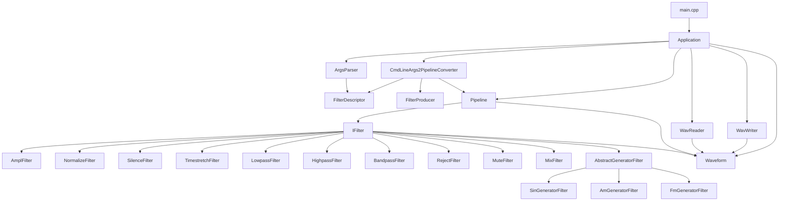
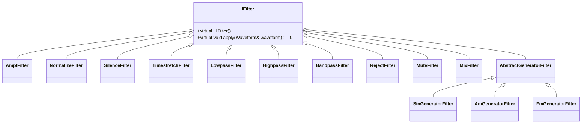
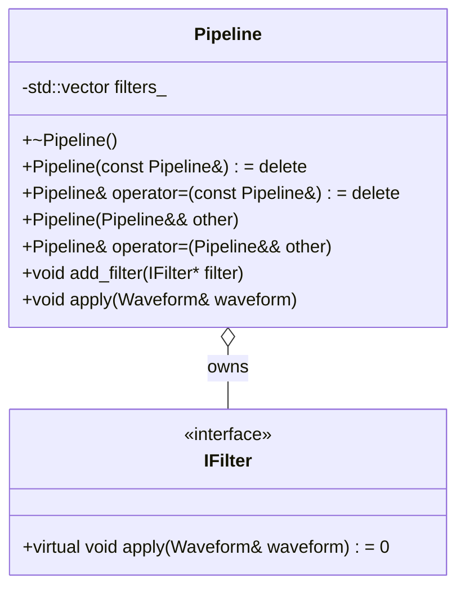
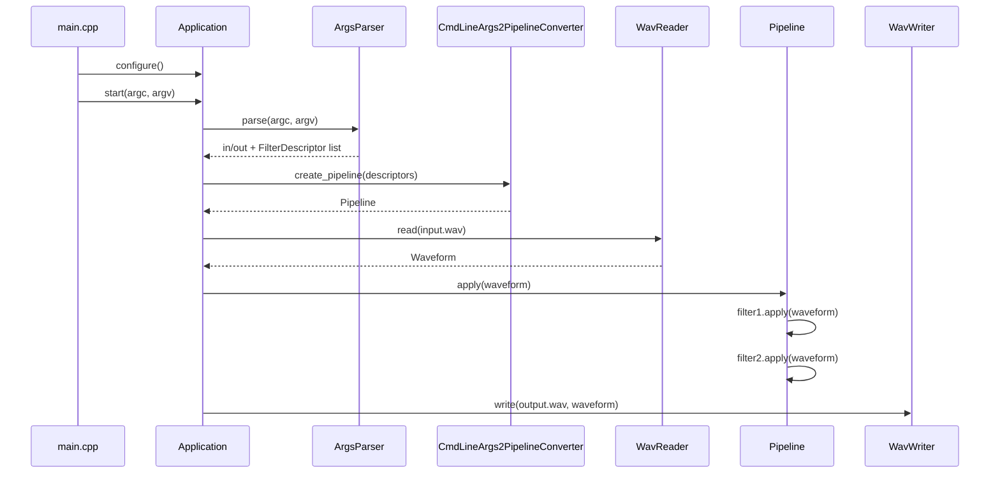

# Схема связи классов Sound Processor

Этот файл описывает, как связаны основные классы проекта. Его можно использовать на защите, чтобы быстро объяснить архитектуру.

## Краткая схема



## ASCII-версия

```text
main.cpp
  |
  v
Application
  |
  +--> ArgsParser
  |       |
  |       v
  |   FilterDescriptor
  |
  +--> CmdLineArgs2PipelineConverter
  |       |
  |       +--> FilterProducer map
  |       |       |
  |       |       v
  |       |   concrete IFilter objects
  |       |
  |       v
  |   Pipeline
  |       |
  |       v
  |   IFilter* list
  |
  +--> WavReader ----> Waveform
  +--> WavWriter <---- Waveform
```

## Что означает каждая связь

### 1. `main.cpp -> Application`

`main()` почти ничего не делает сам. Он:
1. создает `Application`;
2. вызывает `app.configure()`;
3. вызывает `app.start(argc, argv)`;
4. ловит исключения верхнего уровня.

Это соответствует ТЗ: `main()` должен быть в модуле `main.cpp`, а верхний уровень должен обрабатывать исключения.

### 2. `Application -> ArgsParser`

`Application::start()` передает `argc/argv` в `ArgsParser`.

`ArgsParser` возвращает:
- входной файл;
- выходной файл;
- список `FilterDescriptor`.

Важно: `ArgsParser` не создает фильтры и не знает их внутреннюю логику.

### 3. `ArgsParser -> FilterDescriptor`

`FilterDescriptor` — простая структура данных:

```cpp
struct FilterDescriptor {
    std::string name;
    std::vector<std::string> params;
};
```

Пример:

```bash
-f ampl 0.8
```

превращается в:

```cpp
FilterDescriptor{
    .name = "ampl",
    .params = {"0.8"}
}
```

Парсер хранит параметры как строки, потому что интерпретировать их должен producer конкретного фильтра.

### 4. `Application -> CmdLineArgs2PipelineConverter`

`Application` вызывает:

```cpp
converter_.create_pipeline(parser.get_filters())
```

`CmdLineArgs2PipelineConverter` преобразует список дескрипторов в `Pipeline`.

### 5. `CmdLineArgs2PipelineConverter -> FilterProducer`

Converter хранит map:

```cpp
std::map<std::string, FilterProducer> producers_;
```

Где:

```cpp
using FilterProducer = IFilter* (*)(const FilterDescriptor&);
```

То есть converter не пишет:

```cpp
if (name == "ampl") ...
if (name == "lowpass") ...
```

Вместо этого он ищет producer в map.

Это важное архитектурное решение из ТЗ: избегаем hardcoding и cross-cutting concern.

### 6. `FilterProducer -> IFilter`

Каждый producer создает конкретный фильтр и возвращает его как `IFilter*`.

Пример:

```cpp
make_ampl(fd) -> new AmplFilter(factor)
make_lowpass(fd) -> new LowpassFilter(window)
make_generator(fd) -> new SinGeneratorFilter(...)
```

Так создается единый тип для всех фильтров — `IFilter*`.

### 7. `Pipeline -> IFilter*`

`Pipeline` хранит:

```cpp
std::vector<IFilter*> filters_;
```

Он не знает, какие именно фильтры внутри. Для него все фильтры одинаковы: у них есть метод:

```cpp
void apply(Waveform& waveform);
```

`Pipeline::apply()` просто проходит по списку:

```cpp
for (IFilter* filter : filters_) {
    filter->apply(waveform);
}
```

### 8. `IFilter -> Waveform`

Все фильтры работают с `Waveform`.

`Waveform` — это модель звукового фрагмента в памяти:
- `std::vector<int16_t> samples_`;
- sample rate;
- channels;
- bits per sample.

Фильтры меняют samples, добавляют samples, удаляют samples или полностью заменяют waveform.

### 9. `WavReader -> Waveform`

`WavReader::read()` читает WAV-файл и возвращает `Waveform`.

То есть:

```text
файл .wav -> WavReader -> Waveform
```

### 10. `WavWriter -> Waveform`

`WavWriter::write()` берет `Waveform` и записывает его в WAV-файл.

То есть:

```text
Waveform -> WavWriter -> файл .wav
```

### 11. `Application -> WavReader / WavWriter`

`Application` координирует ввод-вывод:

1. если нужен input — вызывает `WavReader::read()`;
2. применяет `Pipeline`;
3. если задан output — вызывает `WavWriter::write()`.

## Как фильтры связаны между собой



## Как Pipeline владеет фильтрами



Важно для защиты:
- копирование `Pipeline` запрещено;
- перемещение разрешено;
- деструктор удаляет фильтры;
- это нужно, чтобы не было double delete и висячих указателей.

## Как Application управляет потоком выполнения



## Как объяснить архитектуру одной фразой

```text
ArgsParser превращает argv в FilterDescriptor,
CmdLineArgs2PipelineConverter через FilterProducer превращает дескрипторы в Pipeline,
Pipeline применяет IFilter-ы к Waveform,
а WavReader/WavWriter переводят Waveform в WAV и обратно.
```

## Почему это хорошая архитектура

1. Parser не зависит от конкретных фильтров.
2. Converter не зависит от parser.
3. Pipeline не зависит от того, как фильтры были созданы.
4. Фильтры не зависят от CLI.
5. WAV I/O не зависит от фильтров.
6. Новый фильтр добавляется через producer и регистрацию.
7. Основная обработка звука инвариантна к источнику параметров.

Это соответствует главному требованию ТЗ: приложение должно иметь компонентную архитектуру, где компоненты можно заменять без инвазивных изменений во всем проекте.
